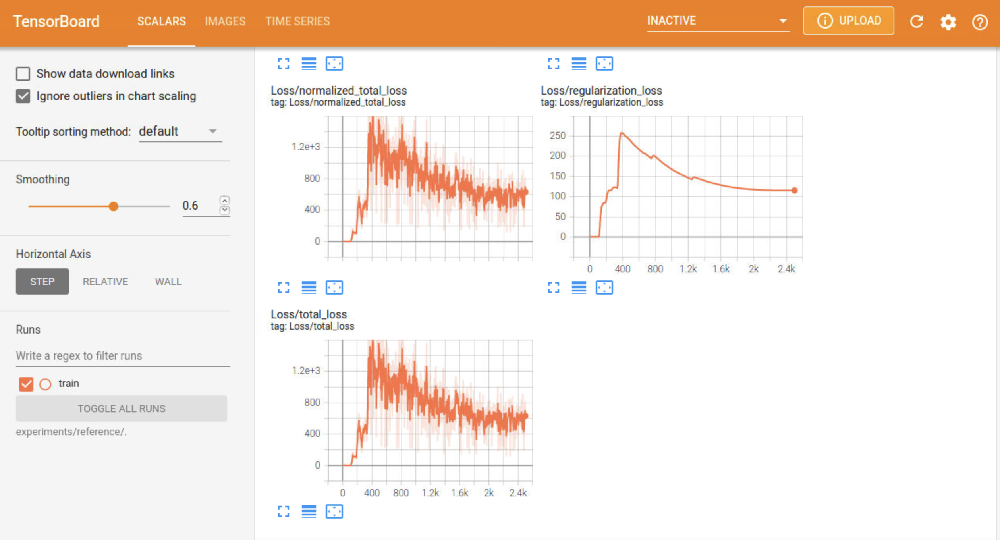
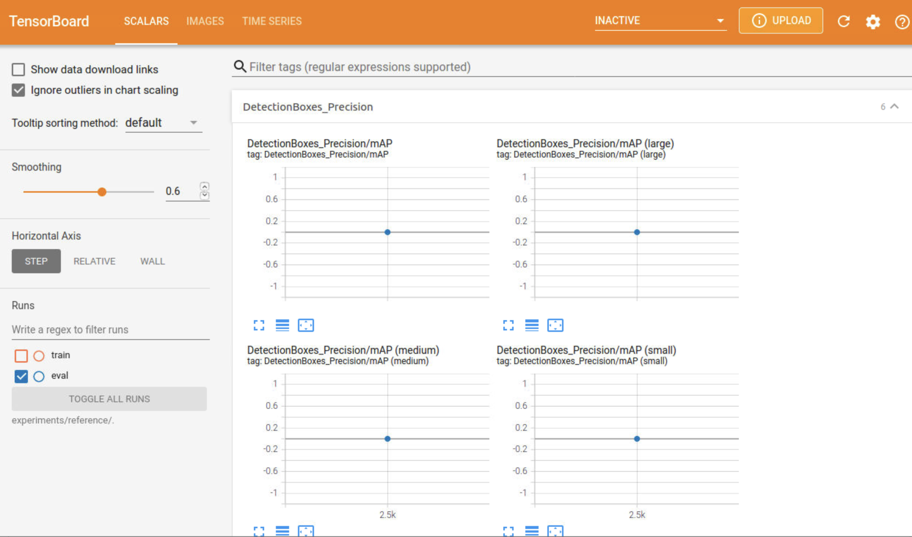
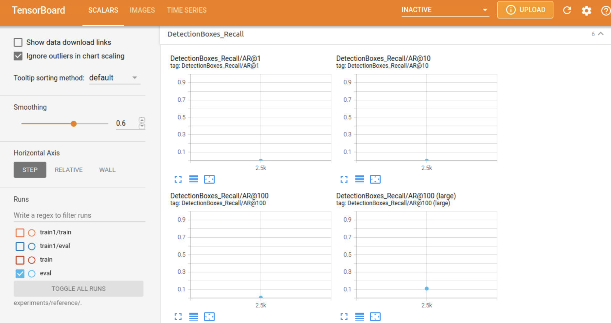

# Project Writeup

# Project overview: 

The goal of the project is to identify objects in an urban environment. We will identify different classes of objects like vehicles, pedestrians, cyclists.
We will use waymo dataset which includes images with annotated vehicles, pedestrians, cyclists.
We will use TensorFlow Object Detection API to train the network and for inference.

Object detection is a very critical part of the self-driving car systems.
This helps the system to identify different types and objects and navigate accordingly.
It is much needed to be accurate to ensure safety of the system and the people involved.

# Set up: 

We will use the classroom project workspace which has the packages installed and data available.

Exploratory Data Analysis.ipynb - Contains the Data analysis done

new_pipeline.config - Contains configurations needed to train and evaluate the tf object detection model

Explore augmentations.ipynb - contains different data augmentations combinations which are best for our dataset

Jupyter notebooks are launched by running sh launch_jupyter.sh

We will use  SSD Resnet 50 640x640 model and TensorFlow Object Detection API .

All tensorboard related event logs(tf.events) are stored in the workspace under experiments/<experiment_num> folders under train/eval subfolders as appropriate

# Dataset:

## Dataset Analysis: 

The Notebook Exploratory Data Analysis.ipynb - Contains the Data analysis done

We will use the data present in /home/workspace/data/train

1. First the dataset is loaded to a tf dataset adapter  using the get_dataset function.

2. Iterate through each image and display the image and bounding boxes.

3. Use scaling to scale the bounding boxes as needed.

4. Use different colors for bounding boxes based on the class it represents.

5. Visually analyze the images and bounding boxes.

  We can observe that data contains images taken in different types of streets like downtown, residential etc.
 Images have different lighting conditions and taken during different times of the day.
 They contain different classes of objects like vehicles, pedestrians, cyclists.
 Note: insert sample images
 
6. Analyse Data distributions. 

  It will be helpful to know how the data is distributed among each class like vehicles,pedestrians, cyclist. We can   look at count of each class detected in the grountruth classes. It will help us to get idea about the driving conditions and data we are looking at.
 We can also use it later on, to validate if our detection/inference finds similar data distribution
 
 For a sample dataset, this is the distribution,there are lot more vehicles and a lesser number of pedestrians.
 Number of cyclists are very few.

### Visually analyze the images and bounding boxes.

Here are some images and their ground truth bouding boxes.
Bounding boxes are color coded with vehicles in red, pedestrians in blue, cyclist in green

##### Images in different types of neighborhood


##### Images in different weather conditions


##### Images with different lighting


### Analyse Data distributions.

 
##### For a sample dataset, this is the distribution  --> ,there are lot more vehicles and a lesser number of pedestrians.
 Number of cyclists are very few.


##### On average there are  18 bounding boxes per image


##### Area of bounding boxes of vehicles is much more larger. pedstrians and cyclists have smaller area.

This makes sense since vehicles are usally bigger.
 


## Cross-validation: 


Data is already available in /home/workspace/data/. Data is split in to folders for train, val and test.

Data in Train is used for training the model and val folder is used for cross validation.

Finally we will use the test dataset for inference on our model.

# Training

It uses TensorFlow Object Detection API and new_pipeline.config which Contains configurations needed to train and evaluate the tf object detection model.

Tensorboard is used to monitor the training and observe needed metrics like loss, precision, recall etc.


## Reference experiment: 

Details about the configuration are found in the folder experiments/reference.

Ran the training using the reference config twice and observed the different metrics.

For the two runs, the loss varied widely. The loss was fluctuating between the two runs.

This is probably because the model was learning different features from different samples of the dataset.

Using the default config file, the performance was not that great as we can see from the loss.


### Run 1 of reference experiment:

 event logs are found in folder experiments/reference/train1.
 
 Regularization loss was around 110 and total loss was around 500.
 
 Here are the tensorboard chart images
 


#### Tensorboard charts during Train




####  Tensorboard charts during eval





### Run 2 of reference experiment:

 event logs are found in folder experiments/reference/train and experiments/reference/eval .
 
 Regularization loss was around 50 and total loss was around 50.
 
 Here are the tensorboard chart images
  

#### Tensorboard charts during Train


####  Tensorboard charts during eval





# Improve on the reference: 

### Explore augmentations.ipynb - contains different data augmentations combinations which are best for our dataset

Tried couple of different experiments to improve upon the reference config.

Tried different data_augmentation_options to provide the model with different images during the training
for the model to learn better.


#### Here are sample of few images with data augmentations. 
More images can be found in the notebook Explore augmentations.ipynb


### Tried couple of different experiments to improve upon the reference config.

Tried different data_augmentation_options to provide the model with different images during the training
for the model to learn better.

## experiment_2:

#### Experiment_2 performed better than the reference model and the best so far in the few experiments conducted.

Regularization loss was around 7 and total loss was around 9. Loss was decreasing as the steps proceeded.
 
Config and event logs are found in folder experiments/experiment_2.


Here were the  data_augmentation_options tried


random_horizontal_flip
    
  
random_crop_image {
      min_object_covered: 0.0
      min_aspect_ratio: 0.75
      max_aspect_ratio: 3.0
      min_area: 0.75
      max_area: 1.0
      overlap_thresh: 0.0
    }
  
random_adjust_hue 
  
random_adjust_saturation 
  
random_adjust_contrast
  
random_adjust_brightness
  
random_rgb_to_gray
  
random_pixel_value_scale 
  
random_distort_color 
  
random_jitter_boxes 


#### Tensorboard charts during Train


####  Tensorboard charts during eval


## experiment_3:

Experiment_3 performed better than the reference model, but  not as consistent as experiment_2.

Regularization loss was around 3 and total loss was fluctuating from 3 to 34. 
 
Loss was not stabilizing much as the steps proceeded.
 
Sometimes the loss was decreasing and sometimes increasing.
 
Config and event logs are found in folder experiments/experiment_3.

Due to lack of memory, used 1200 steps

Here were the  data_augmentation_options tried

random_horizontal_flip 
   
random_crop_image {
      min_object_covered: 0.0
      min_aspect_ratio: 0.75
      max_aspect_ratio: 3.0
      min_area: 0.75
      max_area: 1.0
      overlap_thresh: 0.0
    }

  
random_adjust_hue
  

random_adjust_saturation {
      min_delta :0.7
      max_delta : 1.5
    }

  
random_adjust_contrast {
      min_delta : 0.7
      max_delta : 1.5
    }
  
  
random_adjust_brightness 
  

random_rgb_to_gray {
      probability : 0.5
    }
  
  
random_pixel_value_scale 
  
random_distort_color 


#### Tensorboard charts during Train


####  Tensorboard charts during eval


### Conclusion/ Observations

Data augmentation technique does make the models to perform better. But there are also other parameters which can be changed like optimizer type, learning rate, number of steps etc. We can also try differet models found in the model zoo.


```python

```
