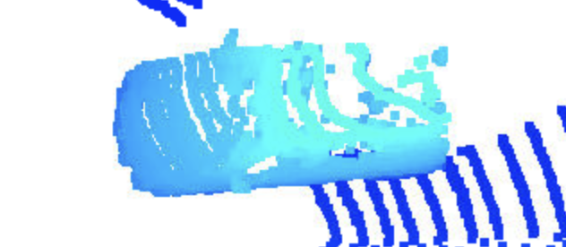
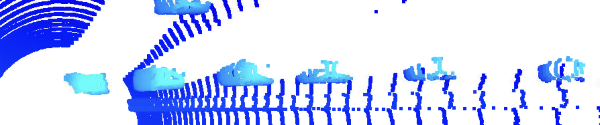
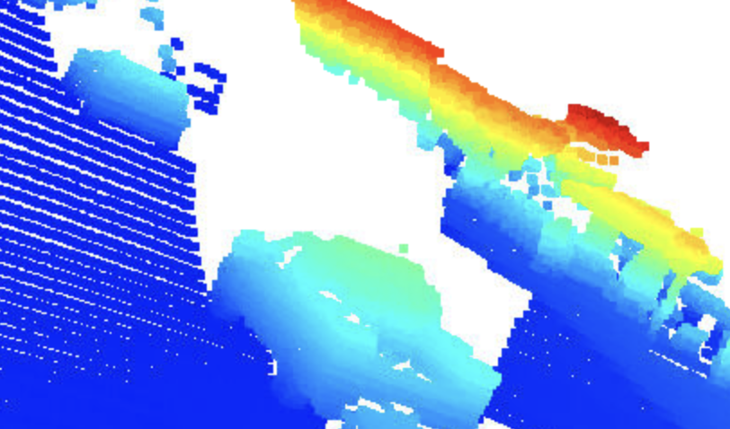
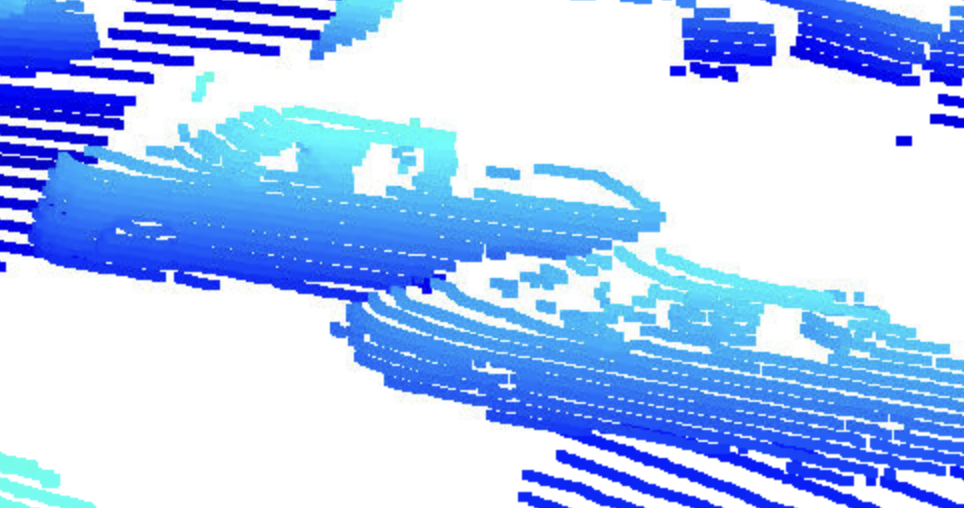
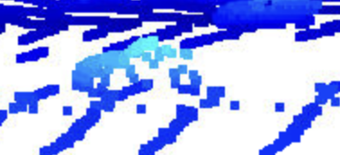
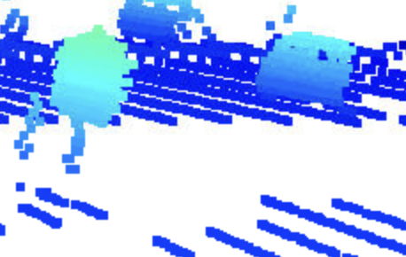
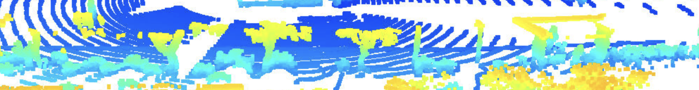
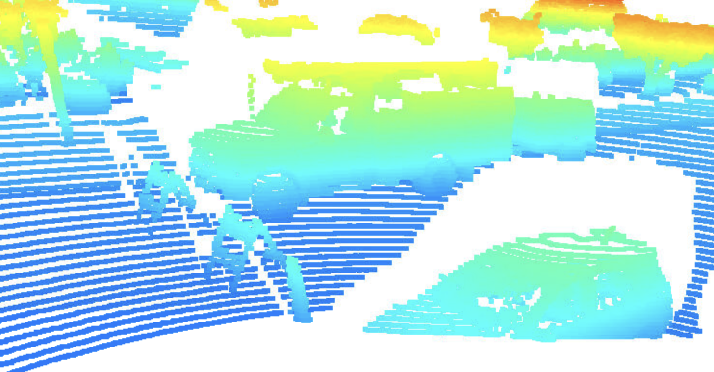
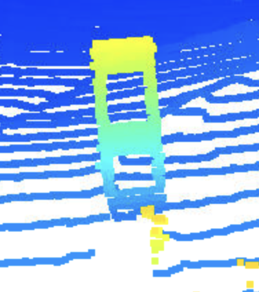

# MidTerm Writeup

## varying degrees of visibility in the point-cloud

Below are few examples for varying degrees of visibility in the point-cloud.

### Image in short distance with many features visible

Vehicles closer to sensor have more features visible.

### Image in long distance with only few features visible

Vehicles farther away from sensor have only few features visible.

### visibility affected due to one vehicle blocking another

Visibility of one vehicle could be blocked by other vehicle.

### side features of a near by vehicle 

Features of a side of a car for a vehicle close by.

### side features of a far vehicle 

Features of a side of a car for a vehicle far away.

### visibility affected by blindspot

visibility could be affected if another car is in blindspot with respect to sensor.

### visibility affected by trees

visibility could be affected by objects like trees.

### visibility affected by lighting conditions

Different lighting conditions could cause images to look different.

### other objects like billboards

