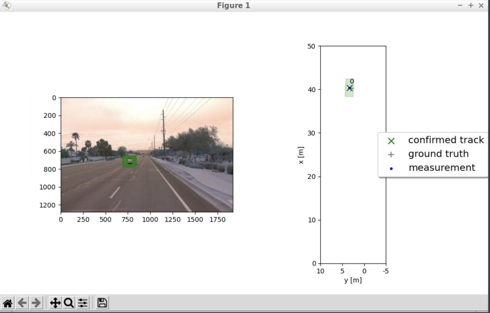
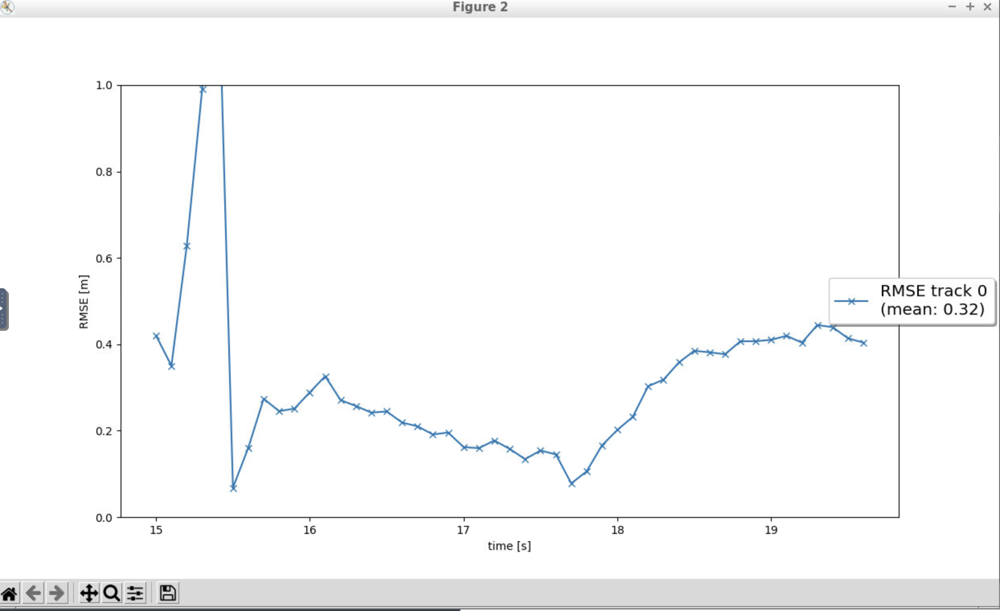
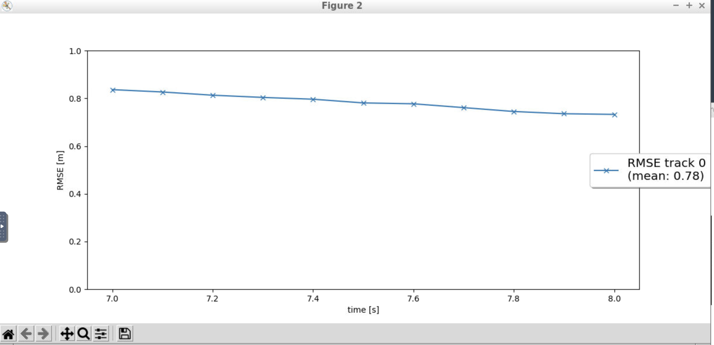

# Writeup: Track 3D-Objects Over Time

Please use this starter template to answer the following questions:

# 1. Write a short recap of the four tracking steps and what you implemented there (filter, track management, association, camera fusion). Which results did you achieve? Which part of the project was most difficult for you to complete, and why?

 
 
 
 

## step1 : Extended Kalman Filter

 

Implemented an EKF to track a single real-world target with lidar measurement input.
implemented the predict() and update() function.
Implemented the F() function to calculate a system matrix for constant velocity process model. Implemented the Q() function to calculate the corresponding process noise covariance
 
 

### step1_Results:

 

We can visualize a single track.
The RMSE is around 0.32

 
 

## step2 : Track management

 
Implemented the track management to initialize and delete tracks. Also set a track state and a track score.
The track is first set to 'initialized' state and set an initial track score. As more measurements come in, the track score is updated and state is moved to 'tentative' or 'confirmed'. 
Also, the track score is decreased for unassigned tracks. Track is Deleted if the score is too low or P is too big. Track is deleted once its not in the visible range.
 
 

### step2_Results:
 

As per the visualization a new track is initialized when unassigned measurements occur and then the track is confirmed . The track is deleted after it has vanished from the visible range. 
The RMSE shows a single line and is around 0.78.

 
 

## step3 : Track Measurement association

 

# 2. Do you see any benefits in camera-lidar fusion compared to lidar-only tracking (in theory and in your concrete results)? 

# 3. Which challenges will a sensor fusion system face in real-life scenarios? Did you see any of these challenges in the project?

# 4. Can you think of ways to improve your tracking results in the future?

